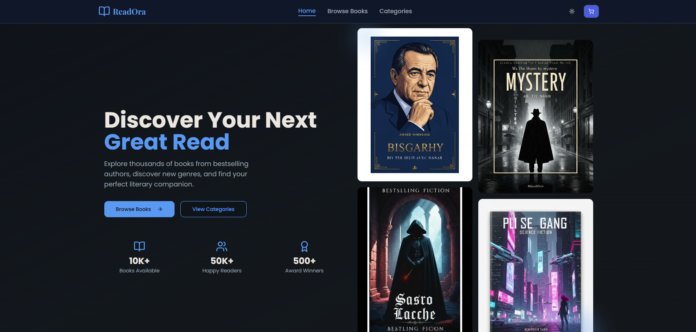
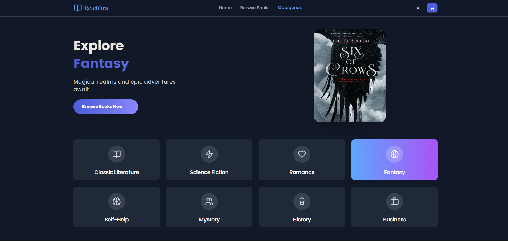
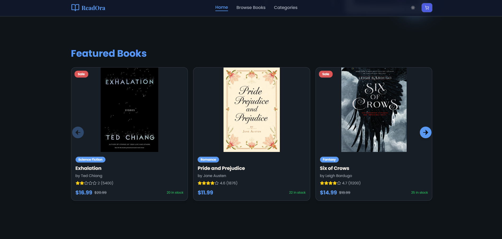
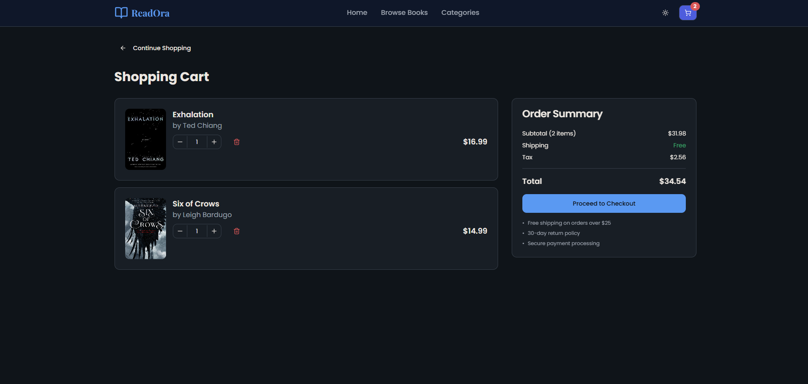
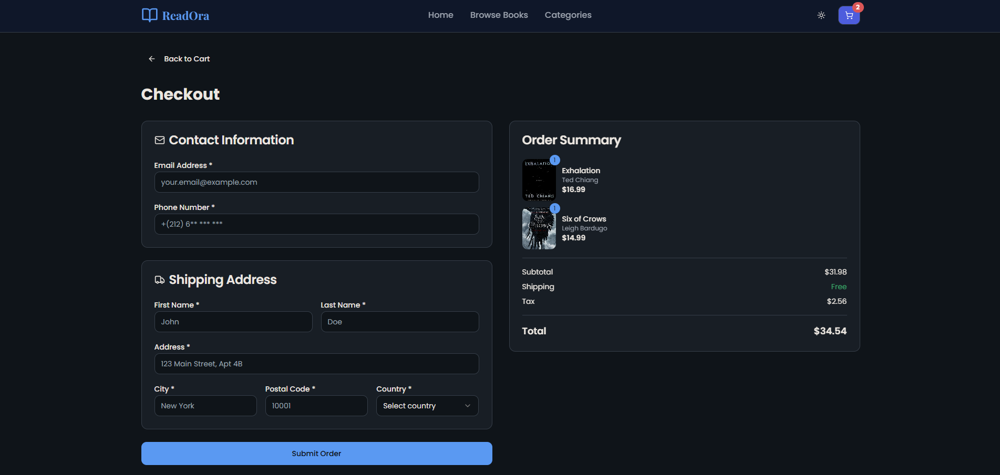

# My React Bookstore

## Project Overview

This is a fully functional **bookstore web application** built from scratch using **React, TypeScript, and Tailwind CSS**.  
It allows users to browse books, filter by category and price, add items to a shopping cart, and complete the checkout process.

The app features:

- Dark mode toggle and responsive design

- Category browsing and book filtering


- Add-to-cart functionality with dynamic cart count  

- Checkout and order confirmation pages  

- Reusable UI components (buttons, inputs, tabs, tooltips, alerts, etc.)  
- State management using React Context API  

## Tech Stack

- **React** with **TypeScript**  
- **Vite** as build tool  
- **Tailwind CSS** for styling  
- **shadcn-ui** for UI components  
- Modern JavaScript & TypeScript best practices  

## Installation & Setup

To run the project locally:

```bash
# Clone the repository
git clone https://github.com/chorfichaymaa101/bookstore.git

# Navigate to the project directory
cd bookstore

# Install dependencies
npm install

# Start the development server
npm run dev
